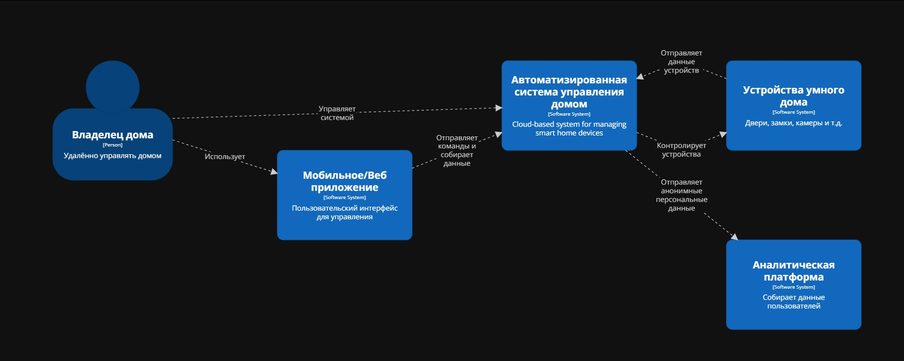

# Лабораторная работа №2
**Тема:** Использование нотации C4 model для проектирования архитектуры программной системы.

**Цель работы:** Получить опыт использования графической нотации для фиксации архитектурных решений.

## Диаграмма системного контекста

## Диаграмма контейнеров

**Базовый архитектурный стиль**

  Микросервисная архитектура + клиент-сервер
  
  **Обоснование:**
  1. Высокая масштабируемость;
  2. Независимое развитие функциональных модулей;
  3. Поддержка сетевого взаимодействия и нескольких модулей развёртывания;
  4. Возможность гибкого расширения.

**Основные контейнеры:**
1. Web/Mobile-client - Пользовательский интерфейс;
2. API Gateway - единая точка входа;
3. Auth Service - аутентификация и авторизация;
4. Device Managment Service - управление устройствами;
5. Automation Service - Автоматизация устройств пользователем;
6. Notification Service - Сервис уведомлений;
7. Video Streaming Setvice - Сервис видеопоток с камер;
8. IoT Gateway - связь с физическими устройствами;
9. Databases - хранение данных.

## Диаграмма компонентов

!

## Доп. диаграмма компонентов

!
