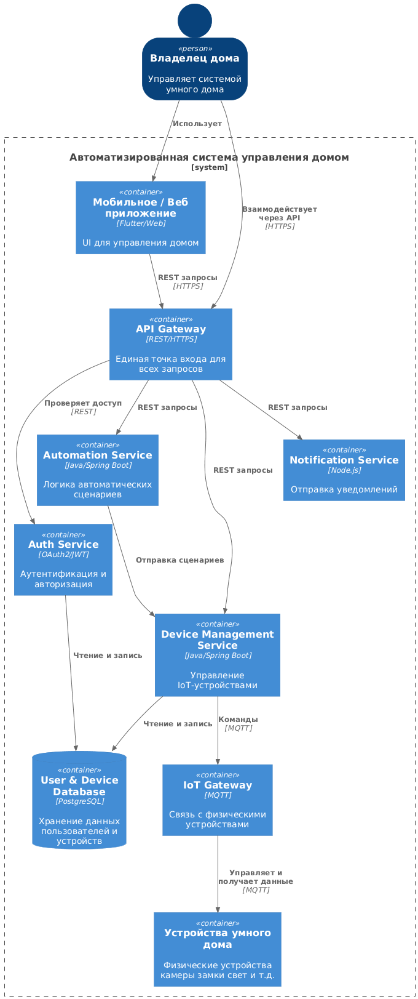
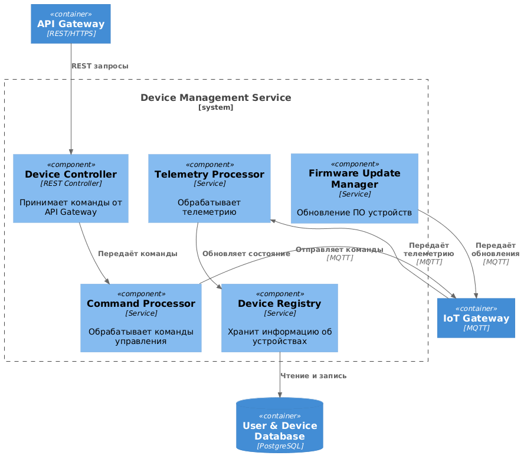
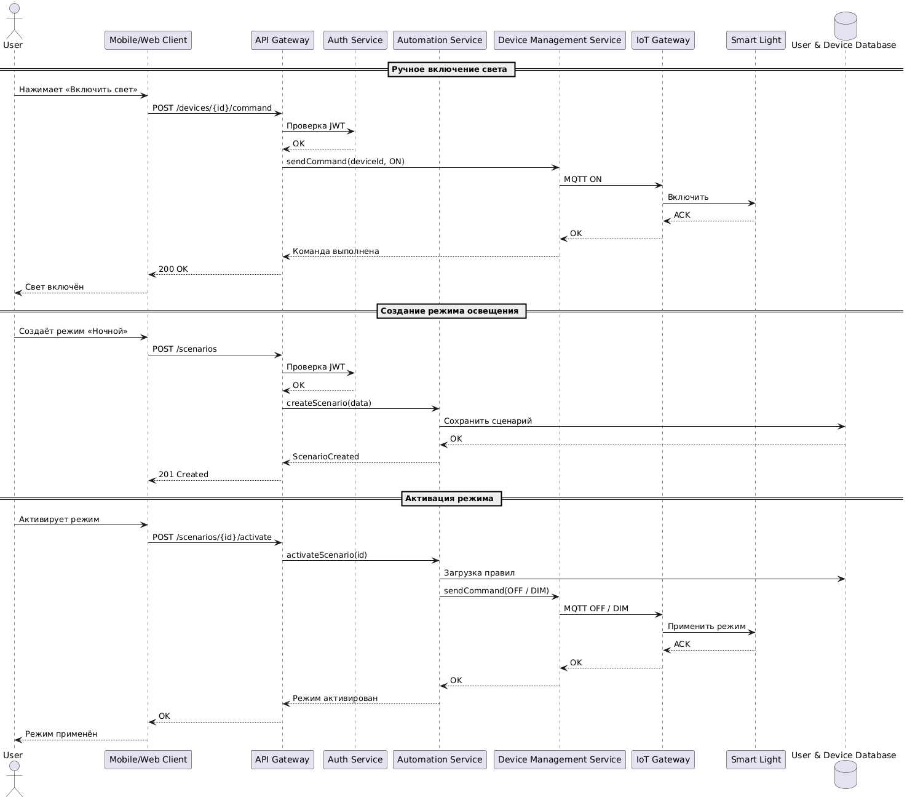
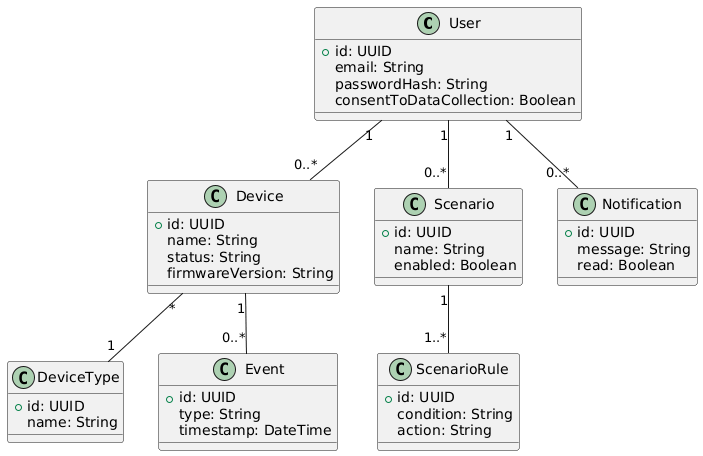

# Лабораторная работа №3
**Тема:** Использование принципов проектирования на уровне методов и классов

**Цель работы:** Получить опыт проектирования и реализации модулей с использованием принципов KISS, YAGNI, DRY, SOLID и др.

### Диаграмма контейнеров



### Диаграмма компонент



### Диаграмма компонент 2


## Диаграмма последовательностей



## Модель БД (UMl диаграмма классов)

**Сущности:**
1. User
2. Device
3. DeviceType
4. Scenario
5. ScenarioRule
6. Event
7. Notification



## Реализация клиентского и серверного кода с учётом принципов KISS, YAGNI, DRY и SOLID.

### Серверная часть

**Модель команды: (KISS)**
```csharp
public record DeviceCommandDto(
    string DeviceId,
    string Action // ON, OFF, DIM
);
```
- Минимальное кол-во полей;
- Нет преждевременного усложнения (YAGNI)

**Контроллер управления устройствами: (SRP)**
```csharp
[ApiController]
[Route("api/devices")]
public class DeviceController : ControllerBase
{
    private readonly IDeviceService _deviceService;

    public DeviceController(IDeviceService deviceService)
    {
        _deviceService = deviceService;
    }

    [HttpPost("{id}/command")]
    public IActionResult SendCommand(string id, DeviceCommandDto command)
    {
        _deviceService.SendCommand(id, command.Action);
        return Ok();
    }
}
```
- SRP — контроллер только принимает HTTP-запрос
- DIP — зависит от интерфейса IDeviceService
- KISS — один endpoint = одно действие

**Интерфейс сервиса управления устройствами: (SOLID — DIP)**
```csharp
public interface IDeviceService
{
    void SendCommand(string deviceId, string action);
}
```

**Реализация сервиса: (DRY, OCP)**
```csharp
public class DeviceService : IDeviceService
{
    private readonly IDeviceCommandSender _commandSender;

    public DeviceService(IDeviceCommandSender commandSender)
    {
        _commandSender = commandSender;
    }

    public void SendCommand(string deviceId, string action)
    {
        _commandSender.Send(deviceId, action);
    }
}
```
- Нет дублирования логики
- Можно заменить протокол без изменения кода

**Абстракция отправки команд: (LSP, ISP)**
```csharp
public interface IDeviceCommandSender
{
    void Send(string deviceId, string action);
}
```

**MQTT-реализация: (OCP)**
```csharp
public class MqttCommandSender : IDeviceCommandSender
{
    public void Send(string deviceId, string action)
    {
        // Отправка MQTT сообщения устройству
        Console.WriteLine($"MQTT -> {deviceId}: {action}");
    }
}
```

**Automation Service — сценарии**

DTO сценария:
```csharp
public record ScenarioDto(
    string Name,
    string DeviceId,
    string Action
);
```

Контроллер сценариев:
```csharp
[ApiController]
[Route("api/scenarios")]
public class ScenarioController : ControllerBase
{
    private readonly IScenarioService _scenarioService;

    public ScenarioController(IScenarioService scenarioService)
    {
        _scenarioService = scenarioService;
    }

    [HttpPost]
    public IActionResult CreateScenario(ScenarioDto dto)
    {
        _scenarioService.Create(dto);
        return Created("", null);
    }

    [HttpPost("{id}/activate")]
    public IActionResult Activate(string id)
    {
        _scenarioService.Activate(id);
        return Ok();
    }
}
```

Сервис сценариев:
```csharp
public interface IScenarioService
{
    void Create(ScenarioDto dto);
    void Activate(string scenarioId);
}

public interface IScenarioService
{
    void Create(ScenarioDto dto);
    void Activate(string scenarioId);
}
```


### Клиентская часть

**Клиент для API: (DRY)**
```csharp
public class SmartHomeApiClient
{
    private readonly HttpClient _http;

    public SmartHomeApiClient(HttpClient http)
    {
        _http = http;
    }

    public async Task TurnOnLight(string deviceId)
    {
        await _http.PostAsJsonAsync(
            $"api/devices/{deviceId}/command",
            new { Action = "ON" }
        );
    }

    public async Task CreateNightMode()
    {
        await _http.PostAsJsonAsync(
            "api/scenarios",
            new { Name = "Night", DeviceId = "device-1", Action = "DIM" }
        );
    }
}
```

**Использование клиента: (KISS)**
```csharp
var apiClient = new SmartHomeApiClient(new HttpClient
{
    BaseAddress = new Uri("https://smarthome.api")
});

await apiClient.TurnOnLight("light-1");
await apiClient.CreateNightMode();
```

### Принципы, и как они учтены

1. KISS (Keep It Simple)
  - Минимальные DTO
  - Прямые REST-вызовы
  - Нет сложных паттернов без необходимости

2. YAGNI (You Aren’t Gonna Need It)
  - Нет ролей пользователей
  - Нет сложного rule-engine
  - Нет поддержки нескольких протоколов одновременно

3. DRY (Don’t Repeat Yourself)
  - Единый SmartHomeApiClient
  - Общий IDeviceService
  - Повторяющаяся логика вынесена в сервисы

4. SOLID
 - SRP: Контроллер ≠ сервис ≠ транспорт
 - OCP: Можно добавить HTTP/CoAP sender
 - LSP: Любая реализация IDeviceCommandSender
 - ISP: Малые интерфейсы
 - DIP: Зависимости через интерфейсы

## Дополнительные принципы разработки

**BDUF — Big Design Up Front:**

***Частичный отказ***

Причина отказа:
- Неизвестное будущее поведение системы
- Высокая вероятность изменения требований

Применение частично:
- Определены контейнеры и ключевые сервисы
- Детали реализации откладываются


**SoC — Separation of Concerns:**

***Применение***

Применение:
- UI ≠ API ≠ бизнес-логика ≠ работа с устройствами
- Отдельные микросервисы

Обоснование:
Упрощает сопровождение и масштабирование.


**MVP — Minimum Viable Product:**

***Применение***

Применение:
- Управление светом
- Замки
- Камеры
- Уведомления

Отложено:
- Сложные сценарии
- Аналитика Big Data


**PoC — Proof of Concept:**

***Применение***

Применение:
- Проверка MQTT-взаимодействия
- Проверка удалённого управления устройствами

Цель:
Подтвердить работоспособность архитектуры до массовых инвестиций
