# Лабораторная работа №6

**Тема:** Использование шаблонов проектирования

**Цель работы:** Получить опыт применения шаблонов проектирования при написании кода программной системы.

---

## Шаблоны проектирования GoF

### Порождающие шаблоны

---

**1. Abstract Factory**

**Общее назначение:** </br>Шаблон предоставляет интерфейс для создания семейств взаимосвязанных объектов без указания их конкретных классов.

**Назначение в проекте:** </br>В системе умного дома требуется поддерживать различные семейства устройств и протоколов: например, Wi‑Fi, Zigbee, BLE, а в будущем и новые стандарты. При этом бизнес-логика не должна зависеть от конкретного производителя устройства.

**В рамках проекта абстрактная фабрика используется для создания совместимых объектов устройств:**
  - Лампа;
  - Дверной замок;
  - Камера;
  - Термостат.

Для каждого семейства протоколов создаётся свой набор реализаций.

**Почему шаблон здесь уместен:**
  - Система должна быть модульной;
  - Ожидается неопределённое поведение в будущем, то есть появление новых типов устройств;
  - Производители и протоколы могут меняться;
  - Клиентский код Device Management Service не должен знать конкретные классы.

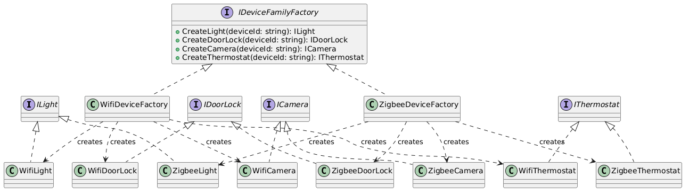

```csharp
using System;
using System.Threading.Tasks;

namespace SmartHome.DeviceModel
{
    public interface ILight
    {
        string DeviceId { get; }
        Task TurnOnAsync();
        Task TurnOffAsync();
    }

    public interface IDoorLock
    {
        string DeviceId { get; }
        Task LockAsync();
        Task UnlockAsync();
    }

    public interface ICamera
    {
        string DeviceId { get; }
        Task StartStreamAsync();
        Task StopStreamAsync();
    }

    public interface IThermostat
    {
        string DeviceId { get; }
        Task SetTemperatureAsync(double value);
    }

    public interface IDeviceFamilyFactory
    {
        ILight CreateLight(string deviceId);
        IDoorLock CreateDoorLock(string deviceId);
        ICamera CreateCamera(string deviceId);
        IThermostat CreateThermostat(string deviceId);
    }

    // ===== Wi-Fi family =====

    public sealed class WifiLight : ILight
    {
        public string DeviceId { get; }

        public WifiLight(string deviceId) => DeviceId = deviceId;

        public Task TurnOnAsync()
        {
            Console.WriteLine($"[WiFi] Light {DeviceId}: ON");
            return Task.CompletedTask;
        }

        public Task TurnOffAsync()
        {
            Console.WriteLine($"[WiFi] Light {DeviceId}: OFF");
            return Task.CompletedTask;
        }
    }

    public sealed class WifiDoorLock : IDoorLock
    {
        public string DeviceId { get; }

        public WifiDoorLock(string deviceId) => DeviceId = deviceId;

        public Task LockAsync()
        {
            Console.WriteLine($"[WiFi] DoorLock {DeviceId}: LOCK");
            return Task.CompletedTask;
        }

        public Task UnlockAsync()
        {
            Console.WriteLine($"[WiFi] DoorLock {DeviceId}: UNLOCK");
            return Task.CompletedTask;
        }
    }

    public sealed class WifiCamera : ICamera
    {
        public string DeviceId { get; }

        public WifiCamera(string deviceId) => DeviceId = deviceId;

        public Task StartStreamAsync()
        {
            Console.WriteLine($"[WiFi] Camera {DeviceId}: START STREAM");
            return Task.CompletedTask;
        }

        public Task StopStreamAsync()
        {
            Console.WriteLine($"[WiFi] Camera {DeviceId}: STOP STREAM");
            return Task.CompletedTask;
        }
    }

    public sealed class WifiThermostat : IThermostat
    {
        public string DeviceId { get; }

        public WifiThermostat(string deviceId) => DeviceId = deviceId;

        public Task SetTemperatureAsync(double value)
        {
            Console.WriteLine($"[WiFi] Thermostat {DeviceId}: SET {value}");
            return Task.CompletedTask;
        }
    }

    public sealed class WifiDeviceFactory : IDeviceFamilyFactory
    {
        public ILight CreateLight(string deviceId) => new WifiLight(deviceId);
        public IDoorLock CreateDoorLock(string deviceId) => new WifiDoorLock(deviceId);
        public ICamera CreateCamera(string deviceId) => new WifiCamera(deviceId);
        public IThermostat CreateThermostat(string deviceId) => new WifiThermostat(deviceId);
    }

    // ===== Zigbee family =====

    public sealed class ZigbeeLight : ILight
    {
        public string DeviceId { get; }

        public ZigbeeLight(string deviceId) => DeviceId = deviceId;

        public Task TurnOnAsync()
        {
            Console.WriteLine($"[Zigbee] Light {DeviceId}: ON");
            return Task.CompletedTask;
        }

        public Task TurnOffAsync()
        {
            Console.WriteLine($"[Zigbee] Light {DeviceId}: OFF");
            return Task.CompletedTask;
        }
    }

    public sealed class ZigbeeDoorLock : IDoorLock
    {
        public string DeviceId { get; }

        public ZigbeeDoorLock(string deviceId) => DeviceId = deviceId;

        public Task LockAsync()
        {
            Console.WriteLine($"[Zigbee] DoorLock {DeviceId}: LOCK");
            return Task.CompletedTask;
        }

        public Task UnlockAsync()
        {
            Console.WriteLine($"[Zigbee] DoorLock {DeviceId}: UNLOCK");
            return Task.CompletedTask;
        }
    }

    public sealed class ZigbeeCamera : ICamera
    {
        public string DeviceId { get; }

        public ZigbeeCamera(string deviceId) => DeviceId = deviceId;

        public Task StartStreamAsync()
        {
            Console.WriteLine($"[Zigbee] Camera {DeviceId}: START STREAM");
            return Task.CompletedTask;
        }

        public Task StopStreamAsync()
        {
            Console.WriteLine($"[Zigbee] Camera {DeviceId}: STOP STREAM");
            return Task.CompletedTask;
        }
    }

    public sealed class ZigbeeThermostat : IThermostat
    {
        public string DeviceId { get; }

        public ZigbeeThermostat(string deviceId) => DeviceId = deviceId;

        public Task SetTemperatureAsync(double value)
        {
            Console.WriteLine($"[Zigbee] Thermostat {DeviceId}: SET {value}");
            return Task.CompletedTask;
        }
    }

    public sealed class ZigbeeDeviceFactory : IDeviceFamilyFactory
    {
        public ILight CreateLight(string deviceId) => new ZigbeeLight(deviceId);
        public IDoorLock CreateDoorLock(string deviceId) => new ZigbeeDoorLock(deviceId);
        public ICamera CreateCamera(string deviceId) => new ZigbeeCamera(deviceId);
        public IThermostat CreateThermostat(string deviceId) => new ZigbeeThermostat(deviceId);
    }

    public sealed class DeviceProvisioningService
    {
        public async Task RegisterStarterKitAsync(IDeviceFamilyFactory factory)
        {
            var light = factory.CreateLight("light-kitchen-01");
            var lockDevice = factory.CreateDoorLock("lock-entry-01");
            var camera = factory.CreateCamera("camera-yard-01");

            await light.TurnOnAsync();
            await lockDevice.LockAsync();
            await camera.StartStreamAsync();
        }
    }
}

```

**Использование Abstract Factory даёт следующие преимущества:**
  - легко подключать новые семейства устройств;
  - бизнес-логика не зависит от конкретных реализаций;
  - проще тестировать сервисы через подмену фабрик;
  - удобно развивать международный продукт с разными поставщиками оборудования.

---

**2. Builder**

**Общее назначение:** </br>Пошагово конструирует сложный объект, отделяя процесс сборки от представления результата.

**Назначение в проекте:** </br>Клиенты должны сами настраивать систему под свои потребности. Это означает, что в системе необходимо создавать сложные объекты типа сценарий автоматизации, состоящие из:
  - триггеров;
  - условий;
  - действий;
  - расписаний;
  - приоритетов;
  - флага активности.

Шаблон Builder позволяет удобно собирать такие сценарии.

**Почему шаблон здесь уместен:**
  - сценарий автоматизации содержит много полей;
  - часть полей необязательна;
  - нужен понятный способ программной сборки сценариев;
  - важна читаемость при конфигурации.

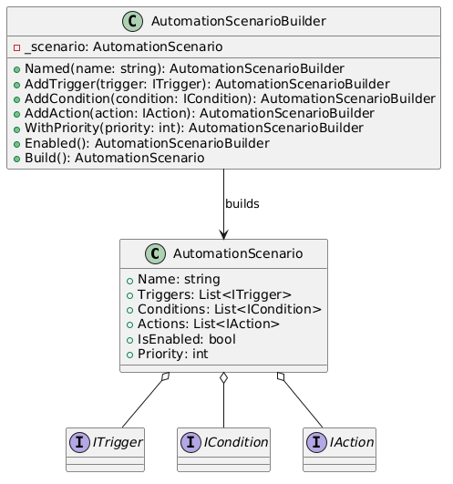

```csharp
using System;
using System.Collections.Generic;
using System.Linq;

namespace SmartHome.Automation
{
    public interface ITrigger
    {
        bool IsTriggered(AutomationContext context);
    }

    public interface ICondition
    {
        bool IsSatisfied(AutomationContext context);
    }

    public interface IAction
    {
        void Execute(AutomationContext context);
    }

    public sealed class AutomationContext
    {
        public DateTime Now { get; init; }
        public string EventName { get; init; } = string.Empty;
        public string DeviceId { get; init; } = string.Empty;
        public Dictionary<string, object> Data { get; init; } = new();
    }

    public sealed class MotionDetectedTrigger : ITrigger
    {
        private readonly string _cameraId;

        public MotionDetectedTrigger(string cameraId) => _cameraId = cameraId;

        public bool IsTriggered(AutomationContext context) =>
            context.EventName == "motion_detected" && context.DeviceId == _cameraId;
    }

    public sealed class TimeRangeCondition : ICondition
    {
        private readonly TimeSpan _from;
        private readonly TimeSpan _to;

        public TimeRangeCondition(TimeSpan from, TimeSpan to)
        {
            _from = from;
            _to = to;
        }

        public bool IsSatisfied(AutomationContext context)
        {
            var time = context.Now.TimeOfDay;
            return time >= _from && time <= _to;
        }
    }

    public sealed class TurnOnLightAction : IAction
    {
        private readonly string _lightId;

        public TurnOnLightAction(string lightId) => _lightId = lightId;

        public void Execute(AutomationContext context)
        {
            Console.WriteLine($"Automation action: turn ON light {_lightId}");
        }
    }

    public sealed class SendPushAction : IAction
    {
        private readonly string _message;

        public SendPushAction(string message) => _message = message;

        public void Execute(AutomationContext context)
        {
            Console.WriteLine($"Automation action: PUSH -> {_message}");
        }
    }

    public sealed class AutomationScenario
    {
        public string Name { get; set; } = string.Empty;
        public List<ITrigger> Triggers { get; } = new();
        public List<ICondition> Conditions { get; } = new();
        public List<IAction> Actions { get; } = new();
        public bool IsEnabled { get; set; }
        public int Priority { get; set; }

        public bool ShouldRun(AutomationContext context)
        {
            if (!IsEnabled)
                return false;

            var triggerMatched = Triggers.Any(t => t.IsTriggered(context));
            var conditionsMatched = Conditions.All(c => c.IsSatisfied(context));

            return triggerMatched && conditionsMatched;
        }

        public void Run(AutomationContext context)
        {
            foreach (var action in Actions)
                action.Execute(context);
        }
    }

    public sealed class AutomationScenarioBuilder
    {
        private readonly AutomationScenario _scenario = new();

        public AutomationScenarioBuilder Named(string name)
        {
            _scenario.Name = name;
            return this;
        }

        public AutomationScenarioBuilder AddTrigger(ITrigger trigger)
        {
            _scenario.Triggers.Add(trigger);
            return this;
        }

        public AutomationScenarioBuilder AddCondition(ICondition condition)
        {
            _scenario.Conditions.Add(condition);
            return this;
        }

        public AutomationScenarioBuilder AddAction(IAction action)
        {
            _scenario.Actions.Add(action);
            return this;
        }

        public AutomationScenarioBuilder WithPriority(int priority)
        {
            _scenario.Priority = priority;
            return this;
        }

        public AutomationScenarioBuilder Enabled()
        {
            _scenario.IsEnabled = true;
            return this;
        }

        public AutomationScenario Build()
        {
            if (string.IsNullOrWhiteSpace(_scenario.Name))
                throw new InvalidOperationException("Scenario name is required.");

            if (_scenario.Triggers.Count == 0)
                throw new InvalidOperationException("At least one trigger is required.");

            if (_scenario.Actions.Count == 0)
                throw new InvalidOperationException("At least one action is required.");

            return _scenario;
        }
    }

    public static class DemoScenarioFactory
    {
        public static AutomationScenario CreateNightSecurityScenario()
        {
            return new AutomationScenarioBuilder()
                .Named("Night security")
                .AddTrigger(new MotionDetectedTrigger("camera-yard-01"))
                .AddCondition(new TimeRangeCondition(
                    from: new TimeSpan(22, 0, 0),
                    to: new TimeSpan(6, 0, 0)))
                .AddAction(new TurnOnLightAction("light-yard-01"))
                .AddAction(new SendPushAction("Обнаружено движение возле дома"))
                .WithPriority(100)
                .Enabled()
                .Build();
        }
    }
}

```

**Builder обеспечивает:**
  - удобное создание пользовательских сценариев;
  - валидацию на этапе сборки;
  - читаемость конфигурации;
  - поддержку будущего расширения сценариев без усложнения конструкторов.

---

**3. Factory Method**

**Общее назначение:** </br>Определяет интерфейс для создания объекта, но позволяет подклассам решать, какой класс создавать.

**Назначение в проекте:** </br>В международной системе уведомлений могут применяться разные каналы доставки:
  - push;
  - email;
  - SMS;
  - в будущем — мессенджеры, голосовые звонки и т.д.

При этом Notification Service должен создавать конкретный канал в зависимости от настроек пользователя, региона и типа события.

**Почему шаблон здесь уместен:**
  - канал выбирается динамически;
  - ожидаются новые способы доставки;
  - бизнес-логика отправки не должна зависеть от конкретного класса отправителя.

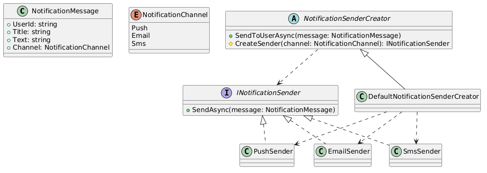

```csharp
using System;
using System.Threading.Tasks;

namespace SmartHome.Notifications
{
    public enum NotificationChannel
    {
        Push,
        Email,
        Sms
    }

    public sealed class NotificationMessage
    {
        public string UserId { get; init; } = string.Empty;
        public string Title { get; init; } = string.Empty;
        public string Text { get; init; } = string.Empty;
        public NotificationChannel Channel { get; init; }
    }

    public interface INotificationSender
    {
        Task SendAsync(NotificationMessage message);
    }

    public sealed class PushSender : INotificationSender
    {
        public Task SendAsync(NotificationMessage message)
        {
            Console.WriteLine($"[PUSH] {message.UserId}: {message.Title} -> {message.Text}");
            return Task.CompletedTask;
        }
    }

    public sealed class EmailSender : INotificationSender
    {
        public Task SendAsync(NotificationMessage message)
        {
            Console.WriteLine($"[EMAIL] {message.UserId}: {message.Title} -> {message.Text}");
            return Task.CompletedTask;
        }
    }

    public sealed class SmsSender : INotificationSender
    {
        public Task SendAsync(NotificationMessage message)
        {
            Console.WriteLine($"[SMS] {message.UserId}: {message.Title} -> {message.Text}");
            return Task.CompletedTask;
        }
    }

    public abstract class NotificationSenderCreator
    {
        public async Task SendToUserAsync(NotificationMessage message)
        {
            var sender = CreateSender(message.Channel);
            await sender.SendAsync(message);
        }

        protected abstract INotificationSender CreateSender(NotificationChannel channel);
    }

    public sealed class DefaultNotificationSenderCreator : NotificationSenderCreator
    {
        protected override INotificationSender CreateSender(NotificationChannel channel)
        {
            return channel switch
            {
                NotificationChannel.Push => new PushSender(),
                NotificationChannel.Email => new EmailSender(),
                NotificationChannel.Sms => new SmsSender(),
                _ => throw new NotSupportedException($"Unsupported channel: {channel}")
            };
        }
    }

    public sealed class NotificationService
    {
        private readonly NotificationSenderCreator _creator;

        public NotificationService(NotificationSenderCreator creator)
        {
            _creator = creator;
        }

        public Task NotifySecurityEventAsync(string userId, string text, NotificationChannel channel)
        {
            var message = new NotificationMessage
            {
                UserId = userId,
                Title = "Security event",
                Text = text,
                Channel = channel
            };

            return _creator.SendToUserAsync(message);
        }
    }
}

```

**Factory Method даёт:**
  - гибкость в выборе канала уведомлений;
  - удобное расширение Notification Service;
  - лучшую поддержку международного продукта;
  - снижение зависимости бизнес-логики от конкретных интеграций.

---

##№Структурные шаблоны

---

**4. Adapter**

**Общее назначение:** </br>Преобразует интерфейс одного класса в другой интерфейс, ожидаемый клиентом.

**Назначение в проекте:** </br>Физические устройства умного дома могут поставляться с разными SDK и протоколами. Например:
  - лампа одного производителя управляется методом PowerAsync;
  - замок другого — методами CloseAsync и OpenAsync;
  - камера третьего — через собственный API запуска стрима.

Чтобы Device Management Service и Automation Service работали с устройствами единообразно, используется адаптер.

**Почему шаблон здесь уместен:**
  - интеграция с множеством поставщиков;
  - разные несовместимые API;
  - необходим единый доменный интерфейс устройств.

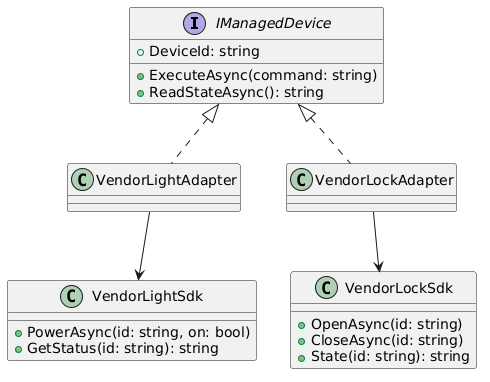

```csharp
using System;
using System.Threading.Tasks;

namespace SmartHome.Adapters
{
    public interface IManagedDevice
    {
        string DeviceId { get; }
        Task ExecuteAsync(string command);
        Task<string> ReadStateAsync();
    }

    // Сторонний SDK лампы
    public sealed class VendorLightSdk
    {
        public Task PowerAsync(string id, bool on)
        {
            Console.WriteLine($"VendorLightSdk: {id} power={on}");
            return Task.CompletedTask;
        }

        public Task<string> GetStatusAsync(string id)
        {
            return Task.FromResult("LightStatus:Online");
        }
    }

    // Сторонний SDK замка
    public sealed class VendorLockSdk
    {
        public Task OpenAsync(string id)
        {
            Console.WriteLine($"VendorLockSdk: {id} open");
            return Task.CompletedTask;
        }

        public Task CloseAsync(string id)
        {
            Console.WriteLine($"VendorLockSdk: {id} close");
            return Task.CompletedTask;
        }

        public Task<string> StateAsync(string id)
        {
            return Task.FromResult("LockStatus:Locked");
        }
    }

    public sealed class VendorLightAdapter : IManagedDevice
    {
        private readonly VendorLightSdk _sdk;

        public string DeviceId { get; }

        public VendorLightAdapter(string deviceId, VendorLightSdk sdk)
        {
            DeviceId = deviceId;
            _sdk = sdk;
        }

        public async Task ExecuteAsync(string command)
        {
            switch (command.ToLowerInvariant())
            {
                case "on":
                    await _sdk.PowerAsync(DeviceId, true);
                    break;
                case "off":
                    await _sdk.PowerAsync(DeviceId, false);
                    break;
                default:
                    throw new InvalidOperationException($"Unsupported light command: {command}");
            }
        }

        public Task<string> ReadStateAsync() => _sdk.GetStatusAsync(DeviceId);
    }

    public sealed class VendorLockAdapter : IManagedDevice
    {
        private readonly VendorLockSdk _sdk;

        public string DeviceId { get; }

        public VendorLockAdapter(string deviceId, VendorLockSdk sdk)
        {
            DeviceId = deviceId;
            _sdk = sdk;
        }

        public async Task ExecuteAsync(string command)
        {
            switch (command.ToLowerInvariant())
            {
                case "lock":
                    await _sdk.CloseAsync(DeviceId);
                    break;
                case "unlock":
                    await _sdk.OpenAsync(DeviceId);
                    break;
                default:
                    throw new InvalidOperationException($"Unsupported lock command: {command}");
            }
        }

        public Task<string> ReadStateAsync() => _sdk.StateAsync(DeviceId);
    }

    public sealed class DeviceExecutionService
    {
        public async Task ExecuteAndLogAsync(IManagedDevice device, string command)
        {
            await device.ExecuteAsync(command);
            var state = await device.ReadStateAsync();

            Console.WriteLine($"Device {device.DeviceId} state after command: {state}");
        }
    }
}
```

**Adapter обеспечивает:**
  - подключение новых устройств без изменения клиентского кода;
  - унификацию управления устройствами;
  - уменьшение зависимости от SDK производителей;
  - упрощение автоматизации и тестирования.

---

**5. Facade**

**Общее назначение:** </br>Предоставляет упрощённый интерфейс к сложной подсистеме.

**Назначение в проекте:** </br>Клиентскому приложению невыгодно напрямую координировать работу множества сервисов:
  - Auth Service;
  - Device Management Service;
  - Automation Service;
  - Notification Service;
  - Video Streaming Service.

Для упрощения используется фасад, инкапсулирующий типовые операции уровня пользователя:
  - открыть приложение и получить панель управления;
  - активировать режим «Никого нет дома»;
  - запросить камеру;
  - включить группу устройств;
  - получить сводный статус.

**Почему шаблон здесь уместен:**
  - клиенту нужен простой API;
  - уменьшается связность между UI и внутренними сервисами;
  - упрощается развитие backend-архитектуры.

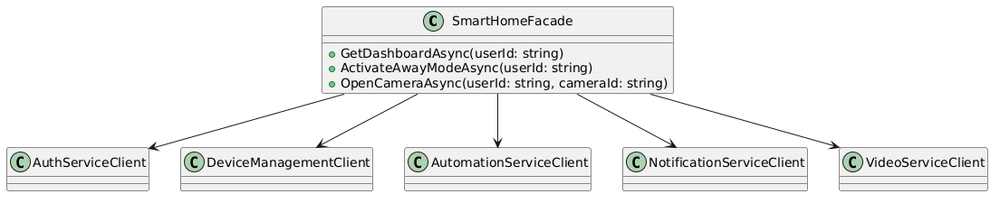

```csharp
using System;
using System.Collections.Generic;
using System.Threading.Tasks;

namespace SmartHome.FacadeLayer
{
    public sealed class DashboardDto
    {
        public string UserName { get; init; } = string.Empty;
        public List<string> Devices { get; init; } = new();
        public List<string> ActiveScenarios { get; init; } = new();
        public List<string> Alerts { get; init; } = new();
    }

    public sealed class AuthServiceClient
    {
        public Task<bool> ValidateSessionAsync(string userId)
            => Task.FromResult(true);
    }

    public sealed class DeviceManagementClient
    {
        public Task<List<string>> GetDevicesAsync(string userId)
            => Task.FromResult(new List<string> { "light-kitchen-01", "lock-entry-01", "camera-yard-01" });

        public Task SetHomeModeAsync(string userId, string mode)
        {
            Console.WriteLine($"Devices switched to mode: {mode}");
            return Task.CompletedTask;
        }
    }

    public sealed class AutomationServiceClient
    {
        public Task<List<string>> GetActiveScenariosAsync(string userId)
            => Task.FromResult(new List<string> { "Night security", "Energy saving" });

        public Task ActivateScenarioGroupAsync(string userId, string groupName)
        {
            Console.WriteLine($"Scenario group {groupName} activated");
            return Task.CompletedTask;
        }
    }

    public sealed class NotificationServiceClient
    {
        public Task<List<string>> GetUnreadAlertsAsync(string userId)
            => Task.FromResult(new List<string> { "Motion detected", "Door unlocked" });

        public Task SendSystemMessageAsync(string userId, string text)
        {
            Console.WriteLine($"System message to {userId}: {text}");
            return Task.CompletedTask;
        }
    }

    public sealed class VideoServiceClient
    {
        public Task<string> CreateStreamTokenAsync(string userId, string cameraId)
            => Task.FromResult($"stream-token-for-{cameraId}");
    }

    public sealed class SmartHomeFacade
    {
        private readonly AuthServiceClient _auth;
        private readonly DeviceManagementClient _devices;
        private readonly AutomationServiceClient _automation;
        private readonly NotificationServiceClient _notifications;
        private readonly VideoServiceClient _video;

        public SmartHomeFacade(
            AuthServiceClient auth,
            DeviceManagementClient devices,
            AutomationServiceClient automation,
            NotificationServiceClient notifications,
            VideoServiceClient video)
        {
            _auth = auth;
            _devices = devices;
            _automation = automation;
            _notifications = notifications;
            _video = video;
        }

        public async Task<DashboardDto> GetDashboardAsync(string userId)
        {
            if (!await _auth.ValidateSessionAsync(userId))
                throw new UnauthorizedAccessException("Invalid session");

            var devices = await _devices.GetDevicesAsync(userId);
            var scenarios = await _automation.GetActiveScenariosAsync(userId);
            var alerts = await _notifications.GetUnreadAlertsAsync(userId);

            return new DashboardDto
            {
                UserName = userId,
                Devices = devices,
                ActiveScenarios = scenarios,
                Alerts = alerts
            };
        }

        public async Task ActivateAwayModeAsync(string userId)
        {
            if (!await _auth.ValidateSessionAsync(userId))
                throw new UnauthorizedAccessException("Invalid session");

            await _devices.SetHomeModeAsync(userId, "Away");
            await _automation.ActivateScenarioGroupAsync(userId, "AwayMode");
            await _notifications.SendSystemMessageAsync(userId, "Режим 'Никого нет дома' активирован.");
        }

        public async Task<string> OpenCameraAsync(string userId, string cameraId)
        {
            if (!await _auth.ValidateSessionAsync(userId))
                throw new UnauthorizedAccessException("Invalid session");

            return await _video.CreateStreamTokenAsync(userId, cameraId);
        }
    }
}
```

**Facade даёт:**
  - упрощение клиентского API;
  - снижение связности UI и микросервисов;
  - удобную точку входа для мобильного и веб-клиента;
  - лучшую сопровождаемость и тестируемость.

---

**6. Composite**

**Общее назначение:** </br>Позволяет клиентам единообразно работать как с отдельными объектами, так и с их композициями.

**Назначение в проекте:** </br>В умном доме естественным образом возникают иерархии:
  - дом;
  - этаж;
  - комната;
  - группа устройств;
  - отдельное устройство.

**Пользователь может захотеть:**
  - выключить весь свет на этаже;
  - заблокировать все двери;
  - получить состояние всей комнаты;
  - применить сценарий к группе устройств.

**Почему шаблон здесь уместен:**
  - есть древовидная структура дома;
  - единые операции должны работать как для одного устройства, так и для группы;
  - упрощается UI и логика сценариев.

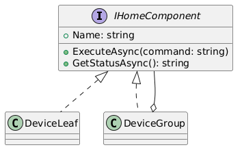

```csharp
using System;
using System.Collections.Generic;
using System.Text;
using System.Threading.Tasks;

namespace SmartHome.CompositeModel
{
    public interface IHomeComponent
    {
        string Name { get; }
        Task ExecuteAsync(string command);
        Task<string> GetStatusAsync();
    }

    public sealed class DeviceLeaf : IHomeComponent
    {
        public string Name { get; }

        public DeviceLeaf(string name)
        {
            Name = name;
        }

        public Task ExecuteAsync(string command)
        {
            Console.WriteLine($"Device {Name} execute: {command}");
            return Task.CompletedTask;
        }

        public Task<string> GetStatusAsync()
        {
            return Task.FromResult($"Device {Name}: OK");
        }
    }

    public sealed class DeviceGroup : IHomeComponent
    {
        private readonly List<IHomeComponent> _children = new();

        public string Name { get; }

        public DeviceGroup(string name)
        {
            Name = name;
        }

        public void Add(IHomeComponent component) => _children.Add(component);
        public void Remove(IHomeComponent component) => _children.Remove(component);

        public async Task ExecuteAsync(string command)
        {
            Console.WriteLine($"Group {Name} execute: {command}");
            foreach (var child in _children)
                await child.ExecuteAsync(command);
        }

        public async Task<string> GetStatusAsync()
        {
            var sb = new StringBuilder();
            sb.AppendLine($"Group {Name}:");

            foreach (var child in _children)
            {
                var status = await child.GetStatusAsync();
                sb.AppendLine(" - " + status);
            }

            return sb.ToString();
        }
    }

    public static class CompositeDemo
    {
        public static async Task RunAsync()
        {
            var kitchen = new DeviceGroup("Kitchen");
            kitchen.Add(new DeviceLeaf("light-kitchen-01"));
            kitchen.Add(new DeviceLeaf("thermostat-kitchen-01"));

            var hallway = new DeviceGroup("Hallway");
            hallway.Add(new DeviceLeaf("light-hall-01"));
            hallway.Add(new DeviceLeaf("lock-entry-01"));

            var floor1 = new DeviceGroup("Floor 1");
            floor1.Add(kitchen);
            floor1.Add(hallway);

            await floor1.ExecuteAsync("turn_off");
            Console.WriteLine(await floor1.GetStatusAsync());
        }
    }
}
```

**Composite позволяет:**
  - единообразно управлять отдельным устройством и группой;
  - естественно моделировать структуру дома;
  - упростить сценарии автоматизации;
  - сократить объём специального кода для групповых операций.

---

**7. Proxy**

**Общее назначение:** </br>Предоставляет суррогат или заместитель другого объекта для контроля доступа к нему.

**Назначение в проекте:** </br>Удалённый доступ к видеопотоку — чувствительная и ресурсоёмкая операция. Необходимо:
  - проверять права пользователя;
  - ограничивать время доступа;
  - кешировать токены;
  - логировать попытки доступа;
  - скрывать реальную реализацию видеосервиса.

Поэтому для камеры используется Proxy.

**Почему шаблон здесь уместен:**
  - видео — дорогой по ресурсам объект;
  - требуется контроль доступа;
  - нужна безопасность при работе через Интернет.

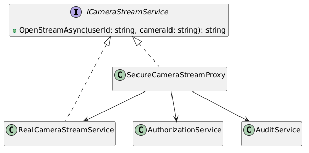

```csharp
using System;
using System.Collections.Generic;
using System.Threading.Tasks;

namespace SmartHome.Video
{
    public interface ICameraStreamService
    {
        Task<string> OpenStreamAsync(string userId, string cameraId);
    }

    public sealed class RealCameraStreamService : ICameraStreamService
    {
        public Task<string> OpenStreamAsync(string userId, string cameraId)
        {
            var token = $"real-stream-token:{cameraId}:{Guid.NewGuid()}";
            Console.WriteLine($"Real stream opened for {cameraId}");
            return Task.FromResult(token);
        }
    }

    public sealed class AuthorizationService
    {
        public Task<bool> CanAccessCameraAsync(string userId, string cameraId)
        {
            return Task.FromResult(true);
        }
    }

    public sealed class AuditService
    {
        public Task WriteAsync(string message)
        {
            Console.WriteLine("[AUDIT] " + message);
            return Task.CompletedTask;
        }
    }

    public sealed class SecureCameraStreamProxy : ICameraStreamService
    {
        private readonly ICameraStreamService _inner;
        private readonly AuthorizationService _authorization;
        private readonly AuditService _audit;
        private readonly Dictionary<string, string> _tokenCache = new();

        public SecureCameraStreamProxy(
            ICameraStreamService inner,
            AuthorizationService authorization,
            AuditService audit)
        {
            _inner = inner;
            _authorization = authorization;
            _audit = audit;
        }

        public async Task<string> OpenStreamAsync(string userId, string cameraId)
        {
            var cacheKey = $"{userId}:{cameraId}";

            if (!await _authorization.CanAccessCameraAsync(userId, cameraId))
            {
                await _audit.WriteAsync($"Access denied. user={userId}, camera={cameraId}");
                throw new UnauthorizedAccessException("Camera access denied.");
            }

            if (_tokenCache.TryGetValue(cacheKey, out var cachedToken))
            {
                await _audit.WriteAsync($"Cached stream token returned. user={userId}, camera={cameraId}");
                return cachedToken;
            }

            var token = await _inner.OpenStreamAsync(userId, cameraId);
            _tokenCache[cacheKey] = token;

            await _audit.WriteAsync($"New stream token created. user={userId}, camera={cameraId}");
            return token;
        }
    }
}
```

**Proxy позволяет:**
  - централизованно контролировать доступ к камерам;
  - снизить нагрузку за счёт кеширования;
  - логировать обращения;
  - скрыть детали работы реального видеосервиса.

---

### Поведенческие шаблоны

---

**8. Command**

**Общее назначение:** </br>Инкапсулирует запрос как объект, позволяя параметризовать клиентов, ставить операции в очередь, логировать их и поддерживать отмену.

**Назначение в проекте:** </br>Все действия над устройствами удобно представить как команды:
  - включить свет;
  - выключить свет;
  - закрыть замок;
  - открыть замок;
  - сменить температуру.

**Это особенно важно для IoT Gateway, где команды нужно:**
  - ставить в очередь;
  - повторно отправлять;
  - журналировать;
  - исполнять асинхронно.

**Почему шаблон здесь уместен:**
  - доменные действия естественно представлены отдельными командами;
  - команды могут приходить из UI, сценариев автоматизации и расписаний;
  - удобно хранить историю выполнения.

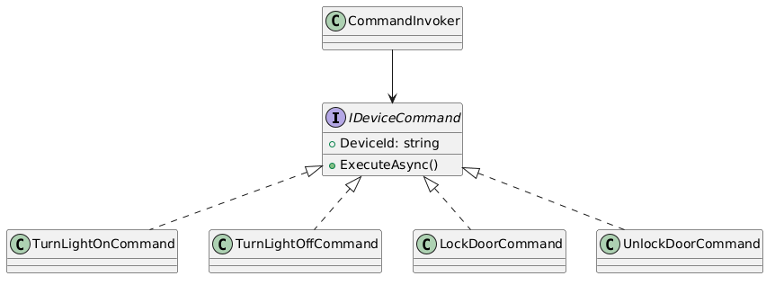

```csharp
using System;
using System.Collections.Generic;
using System.Threading.Tasks;

namespace SmartHome.Commands
{
    public interface IDeviceCommand
    {
        string DeviceId { get; }
        Task ExecuteAsync();
    }

    public sealed class TurnLightOnCommand : IDeviceCommand
    {
        private readonly Func<string, Task> _executor;
        public string DeviceId { get; }

        public TurnLightOnCommand(string deviceId, Func<string, Task> executor)
        {
            DeviceId = deviceId;
            _executor = executor;
        }

        public Task ExecuteAsync() => _executor($"LIGHT_ON:{DeviceId}");
    }

    public sealed class TurnLightOffCommand : IDeviceCommand
    {
        private readonly Func<string, Task> _executor;
        public string DeviceId { get; }

        public TurnLightOffCommand(string deviceId, Func<string, Task> executor)
        {
            DeviceId = deviceId;
            _executor = executor;
        }

        public Task ExecuteAsync() => _executor($"LIGHT_OFF:{DeviceId}");
    }

    public sealed class LockDoorCommand : IDeviceCommand
    {
        private readonly Func<string, Task> _executor;
        public string DeviceId { get; }

        public LockDoorCommand(string deviceId, Func<string, Task> executor)
        {
            DeviceId = deviceId;
            _executor = executor;
        }

        public Task ExecuteAsync() => _executor($"LOCK:{DeviceId}");
    }

    public sealed class UnlockDoorCommand : IDeviceCommand
    {
        private readonly Func<string, Task> _executor;
        public string DeviceId { get; }

        public UnlockDoorCommand(string deviceId, Func<string, Task> executor)
        {
            DeviceId = deviceId;
            _executor = executor;
        }

        public Task ExecuteAsync() => _executor($"UNLOCK:{DeviceId}");
    }

    public sealed class CommandInvoker
    {
        private readonly Queue<IDeviceCommand> _queue = new();

        public void Enqueue(IDeviceCommand command) => _queue.Enqueue(command);

        public async Task ExecuteAllAsync()
        {
            while (_queue.Count > 0)
            {
                var command = _queue.Dequeue();
                Console.WriteLine($"Executing command for device {command.DeviceId}");
                await command.ExecuteAsync();
            }
        }
    }

    public static class IoTTransport
    {
        public static Task SendAsync(string payload)
        {
            Console.WriteLine($"MQTT SEND: {payload}");
            return Task.CompletedTask;
        }
    }

    public static class CommandDemo
    {
        public static async Task RunAsync()
        {
            var invoker = new CommandInvoker();

            invoker.Enqueue(new TurnLightOnCommand("light-kitchen-01", IoTTransport.SendAsync));
            invoker.Enqueue(new LockDoorCommand("lock-entry-01", IoTTransport.SendAsync));
            invoker.Enqueue(new TurnLightOffCommand("light-yard-01", IoTTransport.SendAsync));

            await invoker.ExecuteAllAsync();
        }
    }
}
```

**Command позволяет:**
  - отделить инициатора команды от исполнителя;
  - ставить действия в очередь;
  - вести журнал действий;
  - повторно выполнять и откладывать операции.

---

**9. Observer**

**Общее назначение:** </br>Определяет зависимость «один ко многим», при которой изменение состояния одного объекта автоматически уведомляет зависимые объекты.

**Назначение в проекте:** </br>Устройства порождают события:
  - обнаружено движение;
  - дверь открыта;
  - свет включён;
  - устройство перешло офлайн;
  - температура изменилась.

**На эти события должны реагировать разные подсистемы:**
  - Automation Service;
  - Notification Service;
  - Analytics Platform;
  - аудит безопасности.

**Почему шаблон здесь уместен:**
  - одно событие вызывает реакции нескольких подсистем;
  - важно ослабить связность между источником события и подписчиками;
  - система должна масштабироваться.

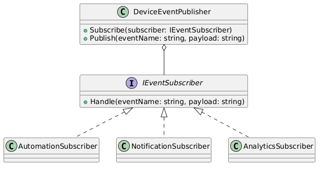

```csharp
using System;
using System.Collections.Generic;
using System.Threading.Tasks;

namespace SmartHome.Events
{
    public sealed class DeviceEvent
    {
        public string EventName { get; init; } = string.Empty;
        public string DeviceId { get; init; } = string.Empty;
        public DateTime OccurredAtUtc { get; init; }
        public Dictionary<string, object> Data { get; init; } = new();
    }

    public interface IEventSubscriber
    {
        Task HandleAsync(DeviceEvent deviceEvent);
    }

    public sealed class DeviceEventPublisher
    {
        private readonly List<IEventSubscriber> _subscribers = new();

        public void Subscribe(IEventSubscriber subscriber) => _subscribers.Add(subscriber);

        public async Task PublishAsync(DeviceEvent deviceEvent)
        {
            foreach (var subscriber in _subscribers)
                await subscriber.HandleAsync(deviceEvent);
        }
    }

    public sealed class AutomationSubscriber : IEventSubscriber
    {
        public Task HandleAsync(DeviceEvent deviceEvent)
        {
            Console.WriteLine($"[Automation] Event {deviceEvent.EventName} from {deviceEvent.DeviceId}");
            return Task.CompletedTask;
        }
    }

    public sealed class NotificationSubscriber : IEventSubscriber
    {
        public Task HandleAsync(DeviceEvent deviceEvent)
        {
            Console.WriteLine($"[Notification] Notify user about {deviceEvent.EventName}");
            return Task.CompletedTask;
        }
    }

    public sealed class AnalyticsSubscriber : IEventSubscriber
    {
        public Task HandleAsync(DeviceEvent deviceEvent)
        {
            Console.WriteLine($"[Analytics] Store anonymized stats for {deviceEvent.EventName}");
            return Task.CompletedTask;
        }
    }

    public static class ObserverDemo
    {
        public static async Task RunAsync()
        {
            var publisher = new DeviceEventPublisher();
            publisher.Subscribe(new AutomationSubscriber());
            publisher.Subscribe(new NotificationSubscriber());
            publisher.Subscribe(new AnalyticsSubscriber());

            await publisher.PublishAsync(new DeviceEvent
            {
                EventName = "motion_detected",
                DeviceId = "camera-yard-01",
                OccurredAtUtc = DateTime.UtcNow,
                Data = new Dictionary<string, object> { ["zone"] = "yard" }
            });
        }
    }
}
```

**Observer даёт:**
  - событийную интеграцию между сервисами;
  - слабую связанность;
  - простое добавление новых подписчиков;
  - хорошую основу для аналитики и автоматизации.

---

**10. Strategy**

**Общее назначение:** </br>Определяет семейство алгоритмов, инкапсулирует каждый из них и делает взаимозаменяемыми.

**Назначение в проекте:** </br>В системе автоматизации возможно возникновение конфликтов между сценариями. Например:
  - один сценарий включает свет;
  - другой одновременно выключает свет;
  - один сценарий разрешает открыть замок;
  - другой блокирует доступ по соображениям безопасности.

**Для разрешения таких конфликтов используются различные стратегии:**
  - приоритетная;
  - безопасная;
  - «последняя команда побеждает».

**Почему шаблон здесь уместен:**
  - поведение выбора алгоритма должно быть заменяемым;
  - у разных клиентов могут быть разные правила;
  - система должна быть расширяемой.

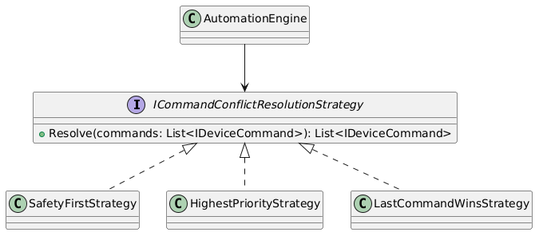

```csharp
using System;
using System.Collections.Generic;
using System.Linq;
using System.Threading.Tasks;

namespace SmartHome.Strategies
{
    public sealed class PlannedCommand
    {
        public string DeviceId { get; init; } = string.Empty;
        public string Operation { get; init; } = string.Empty;
        public int Priority { get; init; }
        public bool IsSafetyCritical { get; init; }
    }

    public interface ICommandConflictResolutionStrategy
    {
        IReadOnlyCollection<PlannedCommand> Resolve(IEnumerable<PlannedCommand> commands);
    }

    public sealed class SafetyFirstStrategy : ICommandConflictResolutionStrategy
    {
        public IReadOnlyCollection<PlannedCommand> Resolve(IEnumerable<PlannedCommand> commands)
        {
            return commands
                .GroupBy(c => c.DeviceId)
                .Select(group =>
                    group
                        .OrderByDescending(x => x.IsSafetyCritical)
                        .ThenByDescending(x => x.Priority)
                        .First())
                .ToList();
        }
    }

    public sealed class HighestPriorityStrategy : ICommandConflictResolutionStrategy
    {
        public IReadOnlyCollection<PlannedCommand> Resolve(IEnumerable<PlannedCommand> commands)
        {
            return commands
                .GroupBy(c => c.DeviceId)
                .Select(group => group.OrderByDescending(x => x.Priority).First())
                .ToList();
        }
    }

    public sealed class LastCommandWinsStrategy : ICommandConflictResolutionStrategy
    {
        public IReadOnlyCollection<PlannedCommand> Resolve(IEnumerable<PlannedCommand> commands)
        {
            return commands
                .GroupBy(c => c.DeviceId)
                .Select(group => group.Last())
                .ToList();
        }
    }

    public sealed class AutomationEngine
    {
        private readonly ICommandConflictResolutionStrategy _strategy;

        public AutomationEngine(ICommandConflictResolutionStrategy strategy)
        {
            _strategy = strategy;
        }

        public async Task ExecuteAsync(IEnumerable<PlannedCommand> commands)
        {
            var resolved = _strategy.Resolve(commands);

            foreach (var command in resolved)
            {
                Console.WriteLine(
                    $"Resolved command -> device={command.DeviceId}, op={command.Operation}, priority={command.Priority}, safety={command.IsSafetyCritical}");
                await Task.CompletedTask;
            }
        }
    }
}
```

**Strategy обеспечивает:**
  - гибкую смену алгоритма без изменения клиента;
  - настройку поведения под конкретный рынок или клиента;
  - упрощение тестирования конфликтных сценариев;
  - соответствие требованию расширяемости.

---

**11. State**

**Общее назначение:** </br>Позволяет объекту изменять своё поведение при изменении внутреннего состояния.

**Назначение в проекте:** </br>Устройства умного дома имеют различные состояния. Особенно показателен пример дверного замка:
  - разблокирован;
  - заблокирован;
  - заблокирован из-за тревоги/взлома;
  - офлайн.

**Поведение системы зависит от текущего состояния. Например:**
  - нельзя разблокировать замок в режиме tampered без дополнительной проверки;
  - нельзя повторно выполнить lock для уже заблокированного замка.

**Почему шаблон здесь уместен:**
  - поведение зависит от состояния объекта;
  - логика состояний не должна превращаться в длинные if/else;
  - состояние замка является отдельной доменной концепцией.

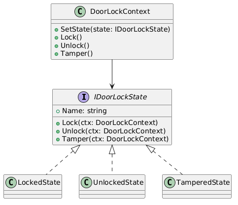

```csharp
using System;
using System.Threading.Tasks;

namespace SmartHome.StateModel
{
    public interface IDoorLockState
    {
        string Name { get; }
        Task LockAsync(DoorLockContext context);
        Task UnlockAsync(DoorLockContext context);
        Task TamperAsync(DoorLockContext context);
    }

    public sealed class DoorLockContext
    {
        private IDoorLockState _state;

        public string DeviceId { get; }

        public DoorLockContext(string deviceId)
        {
            DeviceId = deviceId;
            _state = new UnlockedState();
        }

        public string StateName => _state.Name;

        public void SetState(IDoorLockState state)
        {
            _state = state;
            Console.WriteLine($"DoorLock {DeviceId} state -> {_state.Name}");
        }

        public Task LockAsync() => _state.LockAsync(this);
        public Task UnlockAsync() => _state.UnlockAsync(this);
        public Task TamperAsync() => _state.TamperAsync(this);
    }

    public sealed class LockedState : IDoorLockState
    {
        public string Name => "Locked";

        public Task LockAsync(DoorLockContext context)
        {
            Console.WriteLine($"DoorLock {context.DeviceId} already locked");
            return Task.CompletedTask;
        }

        public Task UnlockAsync(DoorLockContext context)
        {
            Console.WriteLine($"DoorLock {context.DeviceId} unlocking...");
            context.SetState(new UnlockedState());
            return Task.CompletedTask;
        }

        public Task TamperAsync(DoorLockContext context)
        {
            Console.WriteLine($"DoorLock {context.DeviceId} tampered while locked");
            context.SetState(new TamperedState());
            return Task.CompletedTask;
        }
    }

    public sealed class UnlockedState : IDoorLockState
    {
        public string Name => "Unlocked";

        public Task LockAsync(DoorLockContext context)
        {
            Console.WriteLine($"DoorLock {context.DeviceId} locking...");
            context.SetState(new LockedState());
            return Task.CompletedTask;
        }

        public Task UnlockAsync(DoorLockContext context)
        {
            Console.WriteLine($"DoorLock {context.DeviceId} already unlocked");
            return Task.CompletedTask;
        }

        public Task TamperAsync(DoorLockContext context)
        {
            Console.WriteLine($"DoorLock {context.DeviceId} tampered while unlocked");
            context.SetState(new TamperedState());
            return Task.CompletedTask;
        }
    }

    public sealed class TamperedState : IDoorLockState
    {
        public string Name => "Tampered";

        public Task LockAsync(DoorLockContext context)
        {
            Console.WriteLine($"DoorLock {context.DeviceId}: lock denied, service required");
            return Task.CompletedTask;
        }

        public Task UnlockAsync(DoorLockContext context)
        {
            Console.WriteLine($"DoorLock {context.DeviceId}: unlock denied, security check required");
            return Task.CompletedTask;
        }

        public Task TamperAsync(DoorLockContext context)
        {
            Console.WriteLine($"DoorLock {context.DeviceId}: tamper already registered");
            return Task.CompletedTask;
        }
    }
}
```

**State позволяет:**
  - убрать громоздкие условные операторы;
  - централизовать правила поведения по состояниям;
  - сделать логику замка более понятной и расширяемой;
  - повысить качество модели безопасности.

---

**12. Chain of Responsibility**

**Общее назначение:** </br>Позволяет передавать запрос по цепочке обработчиков, пока один из них не обработает его или не отклонит.

**Назначение в проекте:** </br>Перед отправкой команды устройству через API Gateway и Device Management Service необходимо последовательно проверить:
  - аутентификацию;
  - принадлежность устройства пользователю;
  - доступность устройства;
  - ограничения безопасности;
  - корректность команды.

Такой pipeline удобно оформить через Chain of Responsibility.

**Почему шаблон здесь уместен:**
  - проверка состоит из независимых этапов;
  - этапы могут меняться;
  - важна расширяемость без переписывания общего процесса.

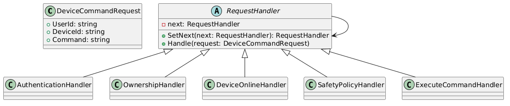

```csharp
using System;
using System.Threading.Tasks;

namespace SmartHome.Pipeline
{
    public sealed class DeviceCommandRequest
    {
        public string UserId { get; init; } = string.Empty;
        public string DeviceId { get; init; } = string.Empty;
        public string Command { get; init; } = string.Empty;
        public bool IsAuthenticated { get; init; }
        public bool IsOwner { get; init; }
        public bool IsOnline { get; init; }
        public bool IsSafe { get; init; }
    }

    public abstract class RequestHandler
    {
        private RequestHandler? _next;

        public RequestHandler SetNext(RequestHandler next)
        {
            _next = next;
            return next;
        }

        public async Task HandleAsync(DeviceCommandRequest request)
        {
            await ProcessAsync(request);

            if (_next != null)
                await _next.HandleAsync(request);
        }

        protected abstract Task ProcessAsync(DeviceCommandRequest request);
    }

    public sealed class AuthenticationHandler : RequestHandler
    {
        protected override Task ProcessAsync(DeviceCommandRequest request)
        {
            if (!request.IsAuthenticated)
                throw new UnauthorizedAccessException("User is not authenticated.");

            Console.WriteLine("Authentication passed");
            return Task.CompletedTask;
        }
    }

    public sealed class OwnershipHandler : RequestHandler
    {
        protected override Task ProcessAsync(DeviceCommandRequest request)
        {
            if (!request.IsOwner)
                throw new UnauthorizedAccessException("User does not own the device.");

            Console.WriteLine("Ownership check passed");
            return Task.CompletedTask;
        }
    }

    public sealed class DeviceOnlineHandler : RequestHandler
    {
        protected override Task ProcessAsync(DeviceCommandRequest request)
        {
            if (!request.IsOnline)
                throw new InvalidOperationException("Device is offline.");

            Console.WriteLine("Device online check passed");
            return Task.CompletedTask;
        }
    }

    public sealed class SafetyPolicyHandler : RequestHandler
    {
        protected override Task ProcessAsync(DeviceCommandRequest request)
        {
            if (!request.IsSafe)
                throw new InvalidOperationException("Command rejected by safety policy.");

            Console.WriteLine("Safety policy passed");
            return Task.CompletedTask;
        }
    }

    public sealed class ExecuteCommandHandler : RequestHandler
    {
        protected override Task ProcessAsync(DeviceCommandRequest request)
        {
            Console.WriteLine($"Command executed: {request.Command} -> {request.DeviceId}");
            return Task.CompletedTask;
        }
    }

    public static class PipelineDemo
    {
        public static async Task RunAsync()
        {
            var auth = new AuthenticationHandler();
            var owner = new OwnershipHandler();
            var online = new DeviceOnlineHandler();
            var safety = new SafetyPolicyHandler();
            var execute = new ExecuteCommandHandler();

            auth.SetNext(owner)
                .SetNext(online)
                .SetNext(safety)
                .SetNext(execute);

            var request = new DeviceCommandRequest
            {
                UserId = "user-1",
                DeviceId = "lock-entry-01",
                Command = "unlock",
                IsAuthenticated = true,
                IsOwner = true,
                IsOnline = true,
                IsSafe = true
            };

            await auth.HandleAsync(request);
        }
    }
}
```

**Chain of Responsibility даёт:**
  - независимость отдельных правил проверки;
  - удобное добавление новых обработчиков;
  - чистую архитектуру pipeline;
  - повышение безопасности работы с устройствами.

---

## Шаблоны проектирования GRASP

### Роли (обязанности) классов

---

**1. Information Expert**

**Проблема:** </br> Кто должен принимать решение о том, нужно ли запускать сценарий автоматизации?

**Решение:** </br> Это должен делать класс, который обладает всей необходимой информацией о триггерах, условиях и действиях — то есть AutomationScenario.

**Пример фрагмента кода:**
```csharp
public sealed class AutomationScenario
{
    public List<ITrigger> Triggers { get; } = new();
    public List<ICondition> Conditions { get; } = new();
    public List<IAction> Actions { get; } = new();
    public bool IsEnabled { get; set; }

    public bool ShouldRun(AutomationContext context)
    {
        if (!IsEnabled)
            return false;

        return Triggers.Any(t => t.IsTriggered(context))
               && Conditions.All(c => c.IsSatisfied(context));
    }
}
```

**Результаты:**
  - логика находится там, где есть нужные данные;
  - уменьшается дублирование;
  - модель становится понятнее.

**Связь с другими паттернами:**
  - Связан с Builder, так как сценарий создаётся пошагово, а затем сам управляет своей логикой как Information Expert.

---

**1. Creator**

**Проблема:** </br> Кто должен создавать конкретные объекты устройств?

**Решение:** </br> Создание поручается фабрикам (WifiDeviceFactory, ZigbeeDeviceFactory), потому что именно они знают, какие объекты входят в соответствующее семейство.

**Пример фрагмента кода:**
```csharp
public sealed class WifiDeviceFactory : IDeviceFamilyFactory
{
    public ILight CreateLight(string deviceId) => new WifiLight(deviceId);
    public IDoorLock CreateDoorLock(string deviceId) => new WifiDoorLock(deviceId);
    public ICamera CreateCamera(string deviceId) => new WifiCamera(deviceId);
    public IThermostat CreateThermostat(string deviceId) => new WifiThermostat(deviceId);
}
```

**Результаты:**
  - логика создания сосредоточена в одном месте;
  - клиентский код проще;
  - система легче расширяется.

**Связь с другими паттернами:**
  - Напрямую связан с Abstract Factory и Factory Method.

---
